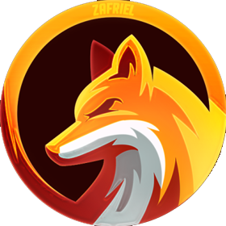

    

 

<h1 align="center">🦊 Zafriel 🦊</h1>

   
   
  <strong><a href="https://discordapp.com/api/oauth2/authorize?client_id=601847636546289664&permissions=271903816&scope=bot">🦊 CLIQUE AQUI PARA ADICIONAR O ZAFRIEL EM SEU SERVIDOR 🐾</a></strong>

[support-invite]: https://discord.gg/zX8Fq4V
[support-image]: https://invidget.switchblade.xyz/zX8Fq4V
[discordbots-widget]: https://discordbots.org/api/widget/601847636546289664.svg
[botsfordiscord-widget]: https://botsfordiscord.com/api/bot/601847636546289664/widget
[discordbotlist-widget]: https://discordbotlist.com/bots/601847636546289664/widget

| Comando            | Descrição                                                     |
| ------------------ | ------------------------------------------------------------- |
| **`z.copyemojis`** | Copia emojis de um servidor para o outro                      |
| **`z.welcome`**    | Sistema de Boas-Vindas                                        |
| **`z.byebye`**     | Sistema de Saída                                              |
| **`z.profile`**    | Profile bonitinho em canvas                                   |
| **`z.modlog`**     | Sistema completo de Logs para seu servidor                    |
| **`z.contador`**   | Sistema de Contador em tópico de canal                        |
| **`z.cmdblock`**   | Bloqueie comandos em chats desejados                          |
| **`z.antinvite`**  | Sistema de Ant-Invite com várias funções ( cargos/chats )     |
| **`z.delete`**     | Faça o Bot deletar as mensagens dele depois de um certo tempo |

## 🐾 O que faz o Zafriel um bom Bot?

> Ele conta com um sistema completo de logs, não tem lag entre os comandos, todos os comandos bem explicados e de fácil uso, entre várias coisas como por exemplo o comando de copiar emojis de um servidor para o outro que eu nunca vi em outro bot

## 🔧 Em que linguagem o Bot foi desenvolvido?

> [JavaScript](https://developer.mozilla.org/en-US/docs/Web/JavaScript) & 

## ❓ Preciso de ajuda, aonde eu devo entrar para contatar a equipe do Bot?

> Caso tenha alguma dúvida basta entrar em nosso servidor de suporte [Discord](https://discord.gg/zX8Fq4V) sempre temos Staff's onlines para responder qualquer dúvida relacionada ao Bot

## ❤️ O que levou o Bot a ser Open Source?

> Muitas pessoas tem dúvidas sobre como desenvolver Bots e como começar, então uma Open Source pode ser lida e compreendida para ajudar você a criar seu própio Bot do 0, caso essa source tenha ajudado você não esqueça de deixar os créditos ( não custa nada ) :) [zSpl1nterUS\_#6455](https://github.com/zSpl1nterUS) 

